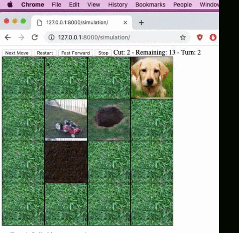

# Lawn-mower Simulator

### Description:
The goal of this project was to learn the Software Architecture and Designing principles and to implement a simulation system for autmatic lawn mower.
This project was completed as a group project, with my contribution in python backend and designing of the system.

### System Requirements:
* Multiple Lawnmowers working collaboratively in one lawn
* Puppy obstacle in addition to fences and craters
* Puppies have the ability to move
* Lawnmower cannot occupy a space where there is a Puppy
* If puppy moves onto a Lawnmower, the mower is stalled until the puppy chooses to
move.
* Mowers share data with each other.
* They have no knowledge of the lawn itself, they must build this knowledge
* Centralized data unit.
* Centralized Simulation monitor

### Demo:
  
[Link to the complete Demo](https://www.youtube.com/watch?v=KxHXOelsYac&feature=youtu.be)  
### Authors:
* Shivam Dhanadhya
* John Rosewicz
* Sam Hinh
* Anagha Akola
* Mamadou Ba
